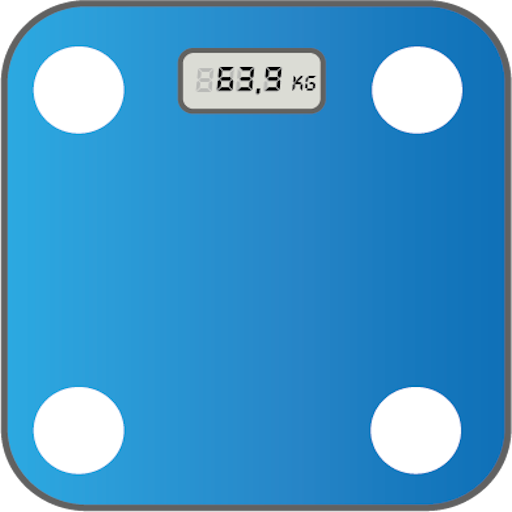

## About :man:

Hi there. I'm João Vitor Freitas.

Currently working as an **Android Engineer** at Nexaas. Enthusiastic about technology and innovation. I believe teamwork and empathy is the key to customer success.

 

## Experience :computer:

### Senior Android Engineer @Nexaa
#### Aug 2020 - Current.
* Designed new hexagonal architecture for the application, constantly doing technical decisions regarding the tech stack and design patterns;
* Reduced first build time project in 75%;
* Created tests and automated processes in CI/CD.

### Android Engineer @Máxima Tech
#### Sep 2018 - Aug 2020 - 2 years.
* Refactored entire app from MVP to MVVM and added Jetpack Components;
* Responsible developer for a route logistics product;
* Responsible developer for a GPS tracking API.

### Trainee Software Developer @ZG Soluções
#### Oct 2017 - Sep 2018 - 1 year.
* Maintenance on a gloss prevention product;
* Maintenance on a web crawler product;
* Created unit tests.

 

## Projects :bulb:

 

## Contact with me :telephone_receiver:

